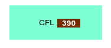
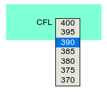

# vscroll_widget

## Customizable jQuery widget for dynamic scrolling drop down menu - created for ATC simulator application - with parameters, and events.

This is a working demo to check basic functionalities - scrolling, selection, window open and close etc.

## Usage

The widget uses its own CSS definitions, therefore **style.css** shall be included properly before usage.
The plugin requires jQuery and jQuery-UI ("jquery": "^3.7.0", "jquery-ui": "^1.13.2" respectively) installed or available to access by main application.

The drop-down scrollable selection widget should be attached any container DOM element - in the example **div.box** has a container ***div.cfl_main_container*** which will be designated as the parent of the label-value(selector window) pair.

The **index.html** contains the generic layout of the DOM tree - to demonstrate how does it look like during operation -, however it's going to be cleared during widget instantiation.

### Instantiation

```javascript
    // app.js
    $vscroll = $('.cfl_main_container').vscroll({min: 280, max: 400, selected: 340});
    $vscroll.vscroll({selected: 390});
    $box = $('.box');
    $box.draggable();
```

Widget has default options which are these:

- visible: 7  - how many items are visible in the opened dropdown scrollable menu (minimum visible is 5, this value shall be *odd number*)
- maxVisible: 13  - maximum number of visible items (*static*)
- min: 0  - default minimum altitude value
- minValue: 0 - lower limit of values in the list
- max: 660  - default maximum altitude value
- maxValue: 660 - upper limit of values in the list
- step: 5 - difference between adjacent altitude values
- minStep: 1  - minimum step size (*deafult 5*)
- maxStep: 10 - maximum step size (*default 5*)
- selected: false - selected altitude value if any (*default false*)
- animate: false  - animation during scroll and *focus* is not used by default (*25 ms*)
- delay: 25 - default timeout for animation (*in ms*)
- focused: 'first'  - if there is no selected altitude in the list, this parameter defines the default value to be focused into viewport when list opened  *// or 'last'*
- testAlt: 343  - for debug purposes, this altitude (*which in fact out of - or in between - the default step size' boundary*) is not included the *round to nearest step sized value* list - demonstrates that the value is conver(*g|t*)ed to the nearest existing list element' value. (*see: _RoundIt(v, n) method in the plugin*)
- autoOpen: false - feature which enables or disables (*by default*) to open up the scrollable dropdown menu at instantiation.

These options could be modified - ok, in some limitations - during the operation: *eg.: dynamically adjust altitude limits, selected altitudes etc.* calling **.vscroll({*option(s)*})**.

The example above demonstrates that the widget were instantiated with *min*, *max*, *selected* options, then adjusted the *selected* value with another one. The widget will reconstruct its DOM structure and style according to the modified options set.

The container div - **div.box** set to draggable - to demonstrate **.vscroll** widget usage even in moving container DOM element at arbitrary viewport location.



**Fig01: div.box draggable container with CFL label and input**



**Fig02: opened dropdown scrollable menu with selected value in visible focus**

If mouse right button pressed no selection happens, the dropdown window closes, static value will be not changed.

However mouse left click on any - *except selected* - value will be updating the static value as well as list items. Next time - if the instance options were not changed - the last selected value will be focused into viewport.

The scrolling feature attached to ***mousewheel*** Event.

*-zg-* **15.06.23**
